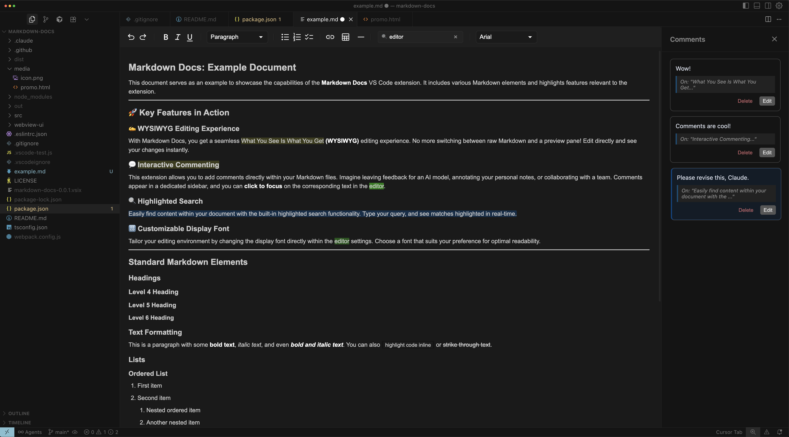

# Markdown Docs: Your Ultimate Markdown Companion

***

**Transform your Markdown workflow with Markdown Docs, a powerful VS Code extension designed for a seamless and intuitive document review and commenting experience.**

Whether you're collaborating with AI, taking personal notes, or working with a team, Markdown Docs provides the tools you need to streamline your process and focus on what matters most: your content.

## A WYSIWYG Editor That Works for You

At the heart of Markdown Docs is a state-of-the-art **What You See Is What You Get (WYSIWYG)** editor, powered by the acclaimed **MDX Editor**. This :comment[means]{#comment-1756395258698 text="test 123123123"} you can say goodbye to constant context switching between raw Markdown and a preview pane. With Markdown Docs, you write and format your documents in a single, beautiful interface.

### Effortless Formatting

Our intuitive toolbar puts all the essential formatting tools at your fingertips:

* **Text Styling:** Undo, Redo, Bold, Italic, Underline, and various font styles.
* **Lists:** Create ordered, unordered, and check lists with ease.
* **Content Blocks:** Insert links and tables effortlessly.
* **Search:** A powerful, highlighted search capability to find what you need, when you need it.
* **Customization:** Change the display font within the editor to suit your preferences.

## Seamless Commenting and Review

Markdown Docs redefines the review process with its intuitive and powerful commenting system.

* **Two-Way Sync:** Click on a comment in the sidebar to instantly jump to the corresponding text in the editor, and vice-versa. This creates a seamless feedback loop that keeps you in flow.
* **Flexible Layout:** The comments side panel is both collapsible and resizable, allowing you to customize your workspace for optimal productivity.

## Use Cases

### AI Collaboration

In the age of AI-driven development and content creation, **Markdown Docs** provides a crucial bridge for human-AI interaction. Use it to:

* **Leave feedback for AI models:** Add comments and annotations to AI-generated markdown to guide and refine the output.
* **Document AI-related workflows:** Keep track of AI-powered analyses, plans, and documentation.
* **Structure your thoughts:** Use the commenting feature to organize your ideas and feedback on AI-generated content.

### Personal Note-Taking

**Markdown Docs** is also a great tool for personal note-taking. Use it to:

* **Annotate articles and documents:** Add your own notes and thoughts to markdown files.
* **Keep a personal journal:** The commenting feature can be used to add dated entries or reflections to the notes.
* **Organize your research:** Keep track of your sources and ideas by adding comments to your research notes.

### Team Collaboration

While not a full-fledged real-time collaboration tool, **Markdown Docs** can be used for asynchronous team collaboration:

* **Code reviews for documentation:** Leave comments and feedback on documentation files in a similar way to code reviews.
* **Share feedback on drafts:** Share markdown files with your team and use the commenting feature to gather feedback.
* **Track changes and suggestions:** The commenting feature provides a clear and organized way to track suggestions and changes.

## We're Open to Feature Requests!

We're always looking for ways to improve Markdown Docs. If you have a feature request or an idea for how we can make the extension better, please don't hesitate to let us know! We're open to all suggestions and contributions.

## Installation

1. Open the **Extensions** view in VS Code.
2. Search for "Markdown Docs".
3. Click **Install**.

## Usage

* **Open with Markdown Docs:** Right-click on a markdown file in the explorer and select "Open with Markdown Docs".
* **Add a comment:** Select a piece of text and click the comment icon in the gutter.
* **Edit a comment:** Click on a comment to edit it.
* **Delete a comment:** Click the delete button on a comment.

## License

This extension is licensed under the MIT License. See the [LICENSE](LICENSE) file for more details.