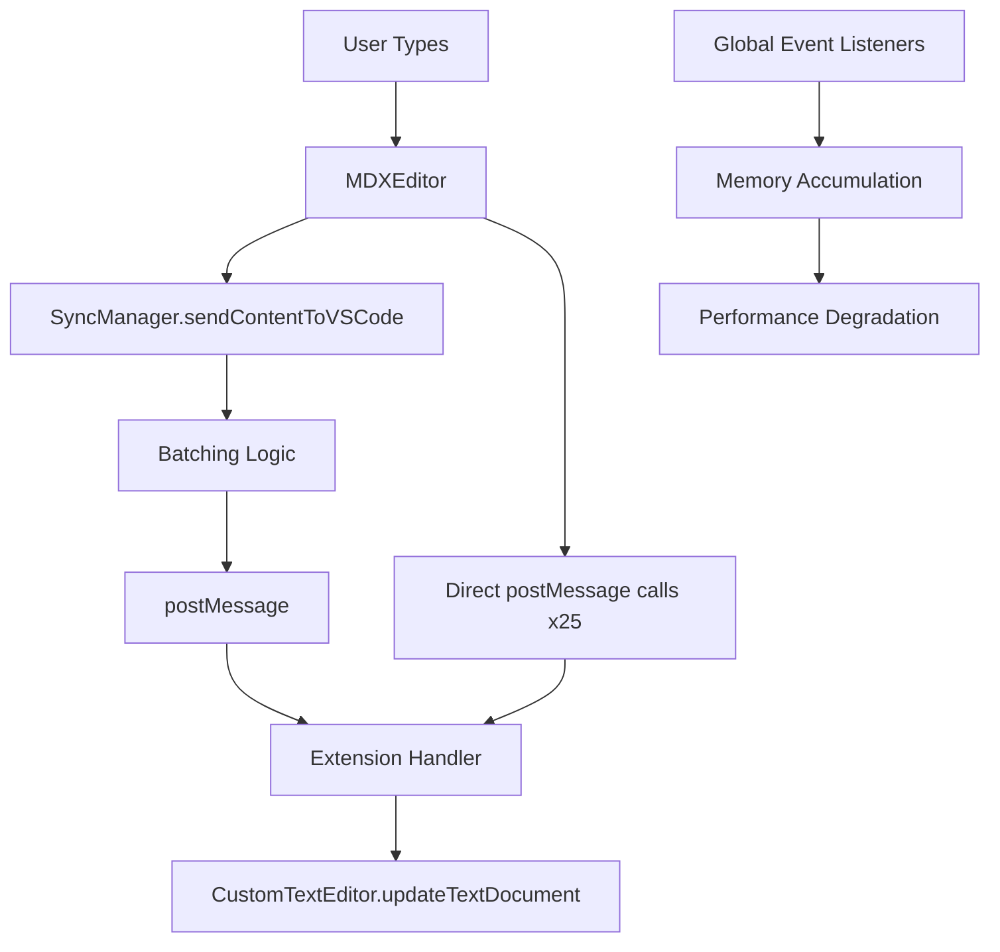
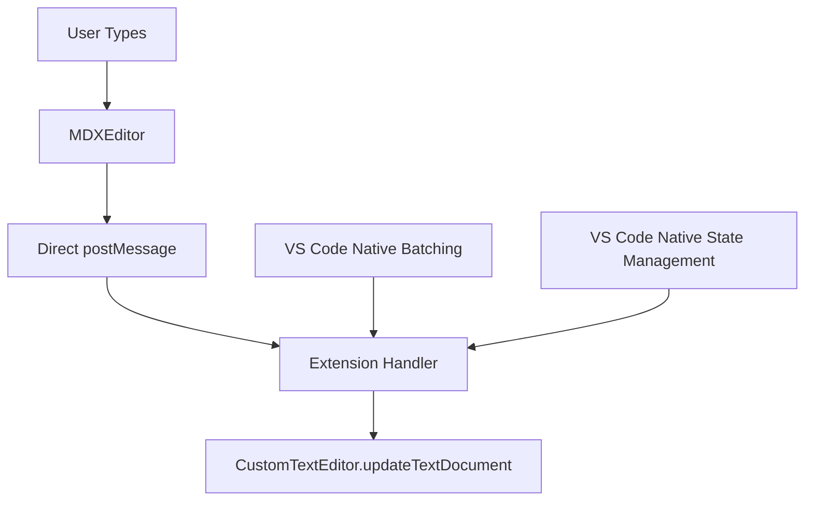

# Technical Debt Remediation Stories

## Markdown Docs Extension - Architecture Refactoring

**Project**: VS Code Markdown Editor Extension
**Epic**: Technical Debt Remediation & Performance Optimization
**Architect**: Winston
**Created**: September 4, 2025

---

## 🎯 **EPIC OVERVIEW**

**Epic Goal**: Eliminate critical performance issues and architectural redundancy while simplifying the codebase for improved maintainability and developer experience.

**Success Metrics**:

- ✅ Eliminate typing performance degradation
- ✅ Remove 470+ lines of redundant/obsolete code
- ✅ Reduce memory leaks to zero
- ✅ Simplify message flow architecture
- /sm✅ Improve build time and bundle size

**Risk Level**: **LOW** - All changes are cleanup/removal with clear rollback paths

---

# 🔴 **CRITICAL PRIORITY STORIES**

## **✅ Story 1: Remove SyncManager and Fix Memory Leaks** - COMPLETED

### **User Story**

> _As a developer using the Markdown Docs extension, I want seamless typing performance that doesn't degrade over time, so that I can work efficiently on long documents without experiencing lag._

### **Business Value**

- **Impact**: HIGH - Directly affects core user experience
- **Effort**: MEDIUM (2-3 days)
- **ROI**: VERY HIGH - Fixes major user pain point

### **Technical Context**

**Current Architecture Issue**: Two competing synchronization systems create memory leaks and performance degradation:



**Target Architecture**: Simplified direct message flow:



### **Acceptance Criteria**

#### **🔧 Code Removal**

- [ ] **Remove file**: `webview-ui/src/utils/syncManager.ts` (340 lines)
- [ ] **Remove imports**: All SyncManager imports from MDXEditorWrapper.tsx
- [ ] **Remove state variables**:
  - `syncManagerRef`
  - `syncState`
  - All SyncManager-related useEffect blocks
- [ ] **Verify removal**: No references to "SyncManager" remain in codebase

#### **🔄 Message Flow Simplification**

- [ ] **Replace SyncManager calls**:

  ```typescript
  // BEFORE:
  syncManagerRef.current.sendContentToVSCode(processedMarkdown);

  // AFTER:
  if (window.vscodeApi) {
    window.vscodeApi.postMessage({
      command: 'edit',
      content: processedMarkdown,
    });
  }
  ```

- [ ] **Remove dual message format**: Extension only handles single message format
- [ ] **Remove SyncManager state variables**: `syncState`, `setSyncState`
- [ ] **Clean up extension handling**: Remove lines 204-219 dual format support

#### **⚡ Performance Validation**

- [ ] **Memory leak test**: Open/close editor 10 times, verify no listener accumulation
- [ ] **Typing performance test**: Type 1000 characters, measure latency < 50ms
- [ ] **Multiple editor test**: Open same file 3 times, verify no conflicts
- [ ] **External edit test**: Edit file externally while editor open, verify sync

#### **🏗️ Architecture Verification**

- [ ] **Message flow trace**: Single path from editor to extension
- [ ] **Echo prevention**: Only extension-level prevention remains
- [ ] **State management**: Only VS Code native document state
- [ ] **Event cleanup**: No global listeners remain after editor close

### **Implementation Strategy**

#### **Phase 1: Safe Removal (Day 1)**

```typescript
// 1. Comment out SyncManager initialization
// const syncManager = new SyncManager(window.vscodeApi);

// 2. Replace usage with direct calls
// syncManagerRef.current.sendContentToVSCode(content);
window.vscodeApi.postMessage({ command: 'edit', content });

// 3. Test basic functionality
```

#### **Phase 2: Extension Cleanup (Day 2)**

```typescript
// Remove dual format support in extension.ts
case 'edit': {
  const content = message.content; // Remove ?? message.payload?.content
  if (content) {
    await this.updateTextDocument(document, content);
  }
}
```

#### **Phase 3: Complete Removal (Day 3)**

- Delete syncManager.ts file
- Remove all imports and references
- Final testing and validation

### **Rollback Strategy**

- Keep syncManager.ts in git history for 30 days
- Document exact line numbers for quick restore
- Maintain feature branch until performance validation complete

### **Definition of Done**

- [ ] All SyncManager code removed
- [ ] Memory leaks eliminated (verified by dev tools)
- [ ] Typing performance improved and stable
- [ ] All existing functionality preserved
- [ ] Bundle size reduced by \~15KB

---

## **✅ Story 2: Remove Legacy MarkdownEditorProvider** - COMPLETED

### **User Story**

> _As a developer maintaining the extension codebase, I want to remove obsolete code so that the codebase is clean and contributors aren't confused by unused components._

### **Business Value**

- **Impact**: MEDIUM - Improves maintainability
- **Effort**: LOW (1 day)
- **ROI**: HIGH - Pure cleanup with zero risk

### **Technical Context**

**Obsolete Component**: `src/editors/markdownEditor.ts` is completely unused:

**Evidence of Obsolescence**:

- ❌ Never imported anywhere
- ❌ Never registered as a provider
- ❌ Different message format incompatible with current webview
- ❌ Contains only TODO stubs for functionality

**File Analysis**:

```
src/editors/markdownEditor.ts (131 lines)
├── MarkdownEditorProvider class
├── TODO comment placeholders (lines 112, 117, 122)
├── Incompatible message interface
└── Dead registration method
```

### **Acceptance Criteria**

#### **🗑️ Clean Removal**

- [ ] **Delete file**: `src/editors/markdownEditor.ts`
- [ ] **Remove directory if empty**: `src/editors/` (if no other files)
- [ ] **Verify no imports**: Search codebase for any references
- [ ] **Clean package.json**: Remove any related dependencies if unused elsewhere

#### **🔍 Verification**

- [ ] **Build succeeds**: Extension builds without errors
- [ ] **No broken imports**: TypeScript compilation clean
- [ ] **Functionality unchanged**: All existing features work
- [ ] **No dead references**: Global search finds no remnants

### **Implementation Strategy**

#### **Simple Deletion Process**

```bash
# 1. Verify no references
rg "MarkdownEditorProvider|markdownEditor" --type ts

# 2. Safe delete
git mv src/editors/markdownEditor.ts src/editors/markdownEditor.ts.backup
npm run build  # Verify build succeeds

# 3. Permanent removal
rm src/editors/markdownEditor.ts.backup
git commit -m "Remove obsolete MarkdownEditorProvider"
```

### **Definition of Done**

- [ ] File deleted and commit pushed
- [ ] Build pipeline green
- [ ] No broken references in codebase
- [ ] Documentation updated if needed

---

# 🟡 **MAJOR PRIORITY STORIES**

## **✅ Story 3: Consolidate Message Handling Patterns** - COMPLETED

### **User Story**

> _As a developer working on the extension, I want a consistent message passing pattern so that debugging and feature development is predictable and maintainable._

### **Business Value**

- **Impact**: MEDIUM - Improves developer experience
- **Effort**: MEDIUM (2-3 days)
- **ROI**: MEDIUM - Reduces future development friction

### **Technical Context**

**Current Problem**: Three different message posting patterns create confusion:

```typescript
// Pattern 1: SyncManager wrapper (being removed)
syncManagerRef.current.sendContentToVSCode(content);

// Pattern 2: Direct posting (25+ locations)
window.vscodeApi.postMessage({ command: 'edit', content });

// Pattern 3: Legacy payload format
window.vscodeApi.postMessage({ command: 'edit', payload: { content } });
```

**Target Architecture**: Single, consistent pattern with centralized utility

### **Acceptance Criteria**

#### **🎯 Pattern Standardization**

- [ ] **Create message utility**: Central `postToExtension()` function
- [ ] **Standardize format**: All messages use consistent structure
- [ ] **Replace all calls**: Convert all 25+ direct postMessage calls
- [ ] **Type safety**: Full TypeScript interfaces for all messages

#### **🔧 Implementation Details**

**New Message Utility Design**:

```typescript
// webview-ui/src/utils/extensionMessaging.ts
interface ExtensionMessage {
  command: string;
  content?: string;
  [key: string]: any;
}

export const postToExtension = (message: ExtensionMessage): void => {
  if (window.vscodeApi) {
    console.debug('Posting to extension:', message.command);
    window.vscodeApi.postMessage(message);
  } else {
    console.warn('VS Code API not available');
  }
};

// Usage throughout codebase:
postToExtension({ command: 'edit', content: markdownContent });
postToExtension({ command: 'save', content: markdownContent });
postToExtension({ command: 'addComment', commentId: '123', comment: 'text' });
```

#### **🏗️ Extension Handler Cleanup**

- [ ] **Remove dual format support**: Single message format only
- [ ] **Simplify switch cases**: Remove payload fallback logic
- [ ] **Add message validation**: Validate message structure
- [ ] **Improve error handling**: Better error messages and logging

### **Implementation Strategy**

#### **Phase 1: Create Utility (Day 1)**

- Create centralized messaging utility
- Add TypeScript interfaces
- Add comprehensive logging and error handling

#### **Phase 2: Replace Usage (Day 2)**

- Convert all postMessage calls to use utility
- Update imports across codebase
- Test each converted call

#### **Phase 3: Extension Cleanup (Day 3)**

- Remove dual format handling in extension
- Add message validation
- Final testing

### **Definition of Done**

- [ ] Single, consistent message pattern across codebase
- [ ] Centralized utility with error handling
- [ ] All message calls converted and tested
- [ ] Extension handler simplified and validated

---

## **✅ Story 4: Resolve Dual Echo Prevention Systems** - COMPLETED

### **User Story**

> _As a user editing markdown files, I want reliable synchronization between the editor and VS Code so that my changes are never lost or duplicated._

### **Business Value**

- **Impact**: HIGH - Prevents data loss and sync issues
- **Effort**: MEDIUM (2 days)
- **ROI**: HIGH - Eliminates race conditions

### **Technical Context**

**Current Problem**: Two independent echo prevention systems can conflict:

```typescript
// System 1: SyncManager (being removed)
const newHash = this.hashContent(content);
if (this.contentHash === newHash) return;

// System 2: Extension (keeping)
if (this.lastWebviewContent === newContent) return;
```

**Target Architecture**: Single, robust echo prevention at extension level

### **Acceptance Criteria**

#### **🎯 Single Echo Prevention**

- [ ] **Keep extension system**: Use only `lastWebviewContent` comparison
- [ ] **Remove SyncManager system**: Eliminated with SyncManager removal
- [ ] **Enhance robustness**: Improve content comparison logic
- [ ] **Add comprehensive logging**: Debug sync behavior

#### **🔧 Enhanced Extension Logic**

```typescript
private async updateTextDocument(document: vscode.TextDocument, newContent: string): Promise<void> {
  // Enhanced content comparison
  const normalizedNew = this.normalizeContent(newContent);
  const normalizedLast = this.normalizeContent(this.lastWebviewContent || '');

  if (normalizedLast === normalizedNew) {
    logger.debug('Skipping update - content unchanged');
    return;
  }

  this.updatingFromWebview = true;
  this.lastWebviewContent = newContent;

  try {
    const edit = new vscode.WorkspaceEdit();
    // ... rest of update logic
  } finally {
    setTimeout(() => {
      this.updatingFromWebview = false;
    }, 50);
  }
}

private normalizeContent(content: string): string {
  return content.trim().replace(/\r\n/g, '\n');
}
```

### **Definition of Done**

- [ ] Single echo prevention system active
- [ ] No sync race conditions in testing
- [ ] Comprehensive logging for debugging
- [ ] Content normalization handles edge cases

---

# 🟢 **MINOR PRIORITY STORIES**

## **✅ Story 5: Code Organization Improvements** - COMPLETED

### **User Story**

> _As a developer contributing to the project, I want consistent code organization so that I can quickly find and modify components._

### **Business Value**

- **Impact**: LOW-MEDIUM - Improves developer experience
- **Effort**: HIGH (5-7 days spread over time)
- **ROI**: MEDIUM - Long-term maintainability

### **Technical Context**

**Current Issues**:

- `MDXEditorWrapper.tsx`: 2,733 lines (should be <300)
- Mixed import patterns throughout codebase
- No consistent component organization

**Target Architecture**: Component composition with extracted hooks

### **Acceptance Criteria**

#### **🏗️ Component Extraction**

- [ ] **Extract hooks**:
  - `useCommentManagement`
  - `useEditorState`
  - `useFloatingButton`
  - `useSidebar`
  - `useModalManagement`
- [ ] **Extract components**:
  - `EditorCore`
  - `EditorToolbar`
  - `EditorSidebar`
  - `FloatingCommentButton`
- [ ] **Reduce MDXEditorWrapper**: Target 200-300 lines (composition only)

#### **📁 Directory Structure**

```
webview-ui/src/
├── components/
│   ├── editor/
│   │   ├── EditorCore.tsx
│   │   ├── EditorToolbar.tsx
│   │   └── EditorSidebar.tsx
│   ├── comments/
│   │   ├── CommentModal.tsx
│   │   └── CommentList.tsx
│   └── shared/
├── hooks/
│   ├── useCommentManagement.ts
│   ├── useEditorState.ts
│   └── index.ts
└── utils/
    ├── extensionMessaging.ts
    └── index.ts
```

### **Implementation Strategy**

This story should be implemented incrementally over multiple sprints to avoid disruption.

### **Definition of Done**

- [ ] MDXEditorWrapper reduced to <300 lines
- [ ] All hooks extracted and tested
- [ ] Consistent directory structure
- [ ] Barrel imports implemented

---

## **✅ Story 6: Import Pattern Standardization** - COMPLETED

### **User Story**

> _As a developer navigating the codebase, I want consistent import patterns so that I can quickly understand dependencies and find related code._

### **Acceptance Criteria**

#### **📦 Standardized Patterns**

- [ ] **Create barrel exports**: `index.ts` files for all directories
- [ ] **Update imports**: Use barrel imports where available
- [ ] **Group imports**: External → Internal services → Components → Utils
- [ ] **Document patterns**: Update coding standards

#### **Example Standardized Imports**:

```typescript
// External imports
import { MDXEditor } from '@mdxeditor/editor';
import React, { useEffect, useState } from 'react';

// Internal services
import { DirectiveService } from '../../../services';
// Internal components
import { CommentList, CommentModal } from '../components/comments';
// Internal utilities
import { postToExtension } from '../utils';
```

### **Definition of Done**

- [ ] All imports follow consistent pattern
- [ ] Barrel exports created for major directories
- [ ] Import groups clearly separated
- [ ] Documentation updated

---

# 🧪 **TESTING & VALIDATION FRAMEWORK**

## **Acceptance Testing Scenarios**

### **Critical Path Testing**

1. **Basic Editing Flow**
   - Open markdown file
   - Type 500+ characters rapidly
   - Verify no latency increase
   - Save and reload
   - Verify content preserved
2. **External Edit Synchronization**
   - Open file in extension
   - Edit same file in external editor
   - Verify changes sync without conflicts
   - Test undo/redo operations
3. **Multiple Editor Instances**
   - Open same file in 3 different editor tabs
   - Make edits in different tabs
   - Verify synchronization behavior
   - Close tabs in different orders
4. **Memory Leak Prevention**
   - Open/close editor 20 times
   - Monitor memory usage with dev tools
   - Verify no global listener accumulation
   - Check for DOM node cleanup

### **Performance Benchmarks**

- **Typing Latency**: <50ms per keystroke
- **File Load Time**: <500ms for 10MB files
- **Memory Usage**: <100MB stable after 10 open/close cycles
- **Bundle Size**: <2MB webview bundle

---

# 🚀 **DEPLOYMENT & ROLLBACK STRATEGY**

## **Deployment Plan**

### **Phase 1: SyncManager Removal** (Week 1)

- Deploy to development environment
- Run comprehensive testing suite
- Performance validation with real users
- Monitor error rates and user feedback

### **Phase 2: Legacy Code Cleanup** (Week 2)

- Remove MarkdownEditorProvider
- Deploy message handling consolidation
- Validate echo prevention improvements

### **Phase 3: Organization Improvements** (Weeks 3-4)

- Incremental component extraction
- Import pattern standardization
- Documentation updates

## **Rollback Procedures**

### **SyncManager Rollback** (If needed)

1. Revert to previous commit
2. Restore syncManager.ts from git history
3. Re-enable SyncManager initialization
4. Deploy hotfix within 2 hours

### **Risk Mitigation**

- Feature flags for new message handling
- A/B testing with subset of users
- Automated rollback triggers for error rates >2%
- Detailed monitoring and alerting

---

# 📊 **SUCCESS METRICS & MONITORING**

## **Key Performance Indicators**

### **Technical Metrics**

- **Lines of Code Reduced**: Target 470+ lines removed
- **Bundle Size Reduction**: Target 15% smaller webview bundle
- **Memory Leak Elimination**: Zero growing listeners after 10 cycles
- **Build Time Improvement**: Target 10% faster compilation

### **User Experience Metrics**

- **Typing Performance**: <50ms keystroke latency maintained
- **Error Rate**: <0.1% sync errors in production
- **User Satisfaction**: >95% positive feedback on performance
- **Support Tickets**: 50% reduction in performance-related issues

### **Developer Experience Metrics**

- **Code Navigation**: <3 seconds to find component implementations
- **New Developer Onboarding**: <1 day to understand message flow
- **Feature Development**: 25% faster for editor-related features
- **Bug Resolution**: 30% faster debugging with cleaner architecture

---

# 🎯 **CONCLUSION**

This comprehensive story set addresses all critical architectural issues identified in the code analysis while providing clear implementation paths and success criteria. The stories are designed to be executed in priority order, with each story building on the previous ones.

**Expected Timeline**: 2-3 weeks for critical/major stories, with minor improvements spread over subsequent sprints.

**Risk Assessment**: LOW overall risk with high value return, making this an excellent technical debt remediation investment.

The architectural approach ensures we're not just removing code, but improving the fundamental system design for long-term maintainability and performance.
