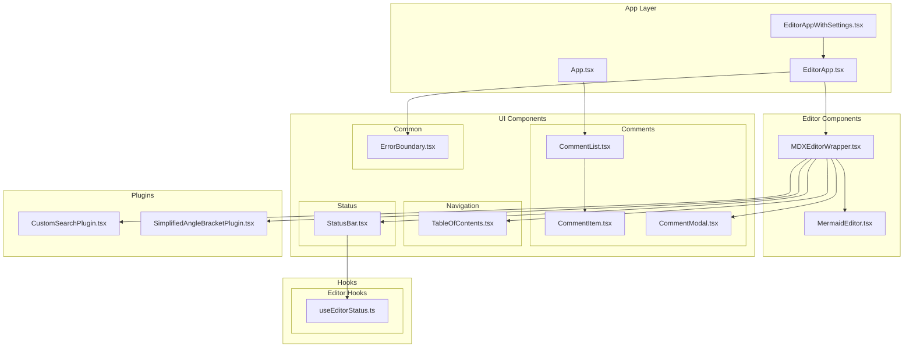

# Markdown Docs Project Cleanup & Organization Architecture

## Introduction

This document outlines the architectural approach for cleaning up and organizing the Markdown Docs VSCode extension project with a focus on cleanly separating hooks and components. Its primary goal is to serve as the guiding architectural blueprint for systematic reorganization while ensuring zero functional impact on the existing application.

**Relationship to Existing Architecture:**
This document supplements existing project architecture by defining how components and hooks will be reorganized into a logical, scalable structure. This reorganization maintains all existing functionality while improving maintainability, navigation, and future development efficiency.

### Existing Project Analysis

**Current Project State:**
- **Primary Purpose:** VSCode extension for rendering markdown documentation with enhanced UI components and interactive features
- **Current Tech Stack:** TypeScript, React 18, MDXEditor, Vite, VS Code Extension API
- **Architecture Style:** Component-based React application with custom hooks, embedded in VS Code webview
- **Deployment Method:** VS Code extension package (.vsix) with webview-based UI

**Available Documentation:**
- README.md with basic project information
- Package.json defining extension structure and dependencies
- TypeScript configuration files
- VS Code extension manifest (package.json)

**Identified Constraints:**
- Must maintain VS Code extension API compatibility
- Zero functional impact requirement - no behavioral changes allowed
- Existing import paths must be updated systematically
- CSS file locations and imports must be preserved
- Component interdependencies must be maintained exactly

### Change Log

| Change | Date | Version | Description | Author |
|--------|------|---------|-------------|---------|
| Initial Architecture | 2025-01-05 | 1.0 | Project cleanup and organization plan | Winston (Architect) |

## Enhancement Scope and Integration Strategy

**Enhancement Overview:**
- **Enhancement Type:** Code Organization & Structure Improvement
- **Scope:** Reorganization of components and hooks into logical directory structure
- **Integration Impact:** Low - Import path updates only, no functional changes

**Integration Approach:**
- **Code Integration Strategy:** Move files to new directory structure with systematic import path updates
- **Database Integration:** Not applicable - no database changes
- **API Integration:** Not applicable - no API changes  
- **UI Integration:** Maintain exact same component behavior and styling

**Compatibility Requirements:**
- **Existing API Compatibility:** Full compatibility maintained - no API changes
- **Database Schema Compatibility:** Not applicable
- **UI/UX Consistency:** Identical user experience - only internal organization changes
- **Performance Impact:** Zero performance impact - only file location changes

## Tech Stack Alignment

### Existing Technology Stack

| Category | Current Technology | Version | Usage in Enhancement | Notes |
|----------|-------------------|---------|---------------------|--------|
| Language | TypeScript | ^5.0 | Maintained exactly | Zero changes to language usage |
| Framework | React | ^18.0 | Maintained exactly | Component patterns unchanged |
| Build Tool | Vite | ^5.0 | Maintained exactly | Build process unchanged |
| Editor | MDXEditor | Latest | Maintained exactly | Editor integration unchanged |
| Extension API | VS Code API | Latest | Maintained exactly | Extension capabilities unchanged |

### New Technology Additions

No new technologies are required for this enhancement. All changes are purely organizational.

## Data Models and Schema Changes

**Schema Integration Strategy:**
- **Database Changes Required:** None
- **New Tables:** None
- **Modified Tables:** None  
- **New Indexes:** None
- **Migration Strategy:** Not applicable

**Backward Compatibility:**
- All data flows remain identical
- No data model changes required

## Component Architecture

### Current Component Analysis

**Existing Components (10 total, 4,608 LOC):**

1. **MDXEditorWrapper.tsx** (3,133 LOC)
   - **Current Issues:** Monolithic component with multiple responsibilities
   - **Proposed Location:** `components/editor/MDXEditorWrapper.tsx`
   - **Integration Impact:** Update imports in EditorApp.tsx

2. **UI Components** (Small, focused components):
   - **CommentItem.tsx** (44 LOC) → `components/ui/comments/CommentItem.tsx`
   - **CommentList.tsx** (37 LOC) → `components/ui/comments/CommentList.tsx`  
   - **CommentModal.tsx** (100 LOC) → `components/ui/comments/CommentModal.tsx`
   - **StatusBar.tsx** (54 LOC) → `components/ui/status/StatusBar.tsx`
   - **TableOfContents.tsx** (78 LOC) → `components/ui/navigation/TableOfContents.tsx`
   - **ErrorBoundary.tsx** (119 LOC) → `components/ui/common/ErrorBoundary.tsx`

3. **Editor Components:**
   - **MermaidEditor.tsx** (443 LOC) → `components/editor/MermaidEditor.tsx`

4. **Plugin Components:**
   - **CustomSearchPlugin.tsx** (452 LOC) → `components/plugins/CustomSearchPlugin.tsx`
   - **SimplifiedAngleBracketPlugin.tsx** (148 LOC) → `components/plugins/SimplifiedAngleBracketPlugin.tsx`

### New Component Organization Strategy

**Component Integration Strategy:**
- **UI Components:** Pure presentation components with minimal business logic
- **Editor Components:** Components directly integrated with editing functionality  
- **Plugin Components:** Modular MDXEditor extensions

**Key Integration Interfaces:**
- Component import paths updated systematically
- CSS import relationships preserved
- Parent-child component relationships maintained exactly

### Component Interaction Diagram



## Source Tree Integration

### Existing Project Structure
```
webview-ui/src/
├── components/          # Flat structure with all components
│   ├── [10 component files]
├── hooks/              # Single hook file
│   └── useEditorStatus.ts
├── utils/              # Utility functions
├── services/           # Service layer
├── types.ts            # Type definitions
├── App.tsx             # Main app components
├── EditorApp.tsx
└── EditorAppWithSettings.tsx
```

### New File Organization
```
webview-ui/src/
├── components/
│   ├── ui/                          # Pure UI components
│   │   ├── comments/               # Comment-related components  
│   │   │   ├── CommentItem.tsx
│   │   │   ├── CommentList.tsx
│   │   │   └── CommentModal.tsx
│   │   ├── navigation/            # Navigation components
│   │   │   └── TableOfContents.tsx
│   │   ├── status/               # Status display components
│   │   │   └── StatusBar.tsx
│   │   └── common/               # Shared UI components
│   │       └── ErrorBoundary.tsx
│   ├── editor/                   # Editor-specific components
│   │   ├── MDXEditorWrapper.tsx  # Main editor
│   │   └── MermaidEditor.tsx     # Specialized editor
│   └── plugins/                  # MDXEditor plugins
│       ├── CustomSearchPlugin.tsx
│       └── SimplifiedAngleBracketPlugin.tsx
├── hooks/
│   ├── editor/                   # Editor-specific hooks
│   │   └── useEditorStatus.ts    # Moved from root hooks/
│   ├── comments/                 # Comment-specific hooks (future)
│   └── ui/                       # UI-specific hooks (future)
├── utils/                        # (unchanged)
├── services/                     # (unchanged)  
├── types.ts                      # (unchanged)
└── [App files]                   # (unchanged)
```

### Integration Guidelines
- **File Naming:** Maintain existing PascalCase for components, camelCase for hooks
- **Folder Organization:** Logical grouping by domain responsibility (ui, editor, plugins)
- **Import/Export Patterns:** Update relative import paths systematically

## Infrastructure and Deployment Integration

### Existing Infrastructure
- **Current Deployment:** VS Code extension package (.vsix) built via npm scripts
- **Infrastructure Tools:** npm, VS Code extension packaging
- **Environments:** Development (VS Code), Production (Extension Marketplace)

### Enhancement Deployment Strategy
- **Deployment Approach:** Zero changes to build pipeline - file moves only affect internal structure
- **Infrastructure Changes:** None required
- **Pipeline Integration:** Existing build process handles new file locations automatically

### Rollback Strategy
- **Rollback Method:** Git revert to previous commit, rebuild extension package
- **Risk Mitigation:** Systematic testing after each migration phase
- **Monitoring:** Manual testing of all functionality after reorganization

## Coding Standards and Conventions

### Existing Standards Compliance
- **Code Style:** TypeScript with React, consistent PascalCase components
- **Linting Rules:** ESLint configuration in place, must continue to pass
- **Testing Patterns:** Minimal testing currently - maintain existing patterns
- **Documentation Style:** JSDoc comments where present

### Critical Integration Rules
- **Existing API Compatibility:** All VS Code API usage remains unchanged
- **Database Integration:** Not applicable
- **Error Handling:** All existing error handling patterns preserved
- **Logging Consistency:** Existing logger usage patterns maintained

## Testing Strategy

### Integration with Existing Tests
- **Existing Test Framework:** Limited testing infrastructure
- **Test Organization:** No major test suite currently
- **Coverage Requirements:** Ensure reorganization doesn't break existing functionality

### New Testing Requirements

#### Unit Tests for New Components
- **Framework:** No changes to testing approach
- **Location:** Tests remain in existing locations
- **Coverage Target:** Functional verification only
- **Integration with Existing:** No new tests required - focus on maintaining function

#### Integration Tests
- **Scope:** Manual testing of all component functionality after reorganization
- **Existing System Verification:** Complete feature testing after each migration phase
- **New Feature Testing:** Not applicable - no new features added

#### Regression Testing
- **Existing Feature Verification:** Systematic manual testing of all extension functionality
- **Automated Regression Suite:** Not currently available
- **Manual Testing Requirements:** Full functionality test after complete reorganization

## Security Integration

### Existing Security Measures
- **Authentication:** VS Code extension API security model
- **Authorization:** Extension permissions via VS Code
- **Data Protection:** Local file system access only
- **Security Tools:** Standard VS Code extension security practices

### Enhancement Security Requirements
- **New Security Measures:** None required - organizational changes only
- **Integration Points:** All existing security boundaries preserved
- **Compliance Requirements:** VS Code extension marketplace compliance maintained

### Security Testing
- **Existing Security Tests:** Manual verification of VS Code API usage
- **New Security Test Requirements:** Verify no new security vectors introduced
- **Penetration Testing:** Not applicable for organizational changes

## Migration Execution Plan

### Phase 1: Infrastructure Setup (Zero Risk)
1. Create new directory structure
2. Verify directories created successfully
3. Run build to confirm no regressions

### Phase 2: Hook Migration (Low Risk)  
1. Move `useEditorStatus.ts` to `hooks/editor/`
2. Update import in `StatusBar.tsx`
3. Verify TypeScript compilation and functionality

### Phase 3: UI Component Migration (Medium Risk)
1. Move comment components to `components/ui/comments/`
2. Move navigation components to `components/ui/navigation/`  
3. Move status components to `components/ui/status/`
4. Move common components to `components/ui/common/`
5. Update all import references
6. Verify all UI functionality

### Phase 4: Editor Component Migration (Medium Risk)
1. Move `MermaidEditor.tsx` to `components/editor/`
2. Update import in `MDXEditorWrapper.tsx`
3. Verify editor functionality

### Phase 5: Plugin Component Migration (Medium Risk)
1. Move plugin components to `components/plugins/`
2. Update imports in `MDXEditorWrapper.tsx`
3. Verify plugin functionality

### Phase 6: Validation & Cleanup
1. Comprehensive functionality testing
2. TypeScript compilation verification
3. CSS styling verification
4. Performance testing
5. Extension packaging test

## Risk Mitigation

### Backup Strategy
- Create backup branch before starting migration
- Commit after each successful phase
- Maintain ability to rollback at any point

### Validation Checkpoints
- TypeScript compilation check after each phase
- Manual functionality testing after component groups
- Build process verification after major changes
- Extension packaging test before completion

## Next Steps

### Story Manager Handoff
With the architecture complete, the next phase involves systematic execution of the migration plan. Each phase should be treated as a separate implementation story with clear validation criteria:

- **Phase 1 Story:** "Set up new directory structure" - Zero risk infrastructure setup
- **Phase 2 Story:** "Migrate editor hooks" - Low risk hook reorganization  
- **Phase 3 Story:** "Reorganize UI components" - Medium risk component migration
- **Phase 4 Story:** "Reorganize editor components" - Medium risk specialized components
- **Phase 5 Story:** "Reorganize plugin components" - Medium risk plugin migration
- **Phase 6 Story:** "Final validation and cleanup" - Comprehensive testing

### Developer Handoff
For developers implementing this reorganization:

1. **Follow Migration Phases:** Execute phases in order, validating after each
2. **Maintain Zero Functional Impact:** Every change must preserve exact existing behavior
3. **Update Import Paths Systematically:** Use find-and-replace to update imports consistently
4. **Test Thoroughly:** Manual testing after each phase to catch issues early
5. **Preserve CSS Relationships:** Ensure all styling continues to work after file moves

**Key Technical Requirements:**
- All TypeScript compilation must pass after each phase
- All existing VS Code extension functionality must work identically
- Build process must continue to work without modification
- Extension packaging must continue to work without changes

**Success Criteria:**
- All components relocated to logical directory structure
- All import paths updated and functional
- All existing functionality preserved exactly
- TypeScript compilation clean
- Extension builds and runs identically to before

This systematic approach ensures a clean, organized codebase while maintaining the critical requirement of zero functional impact on the application.