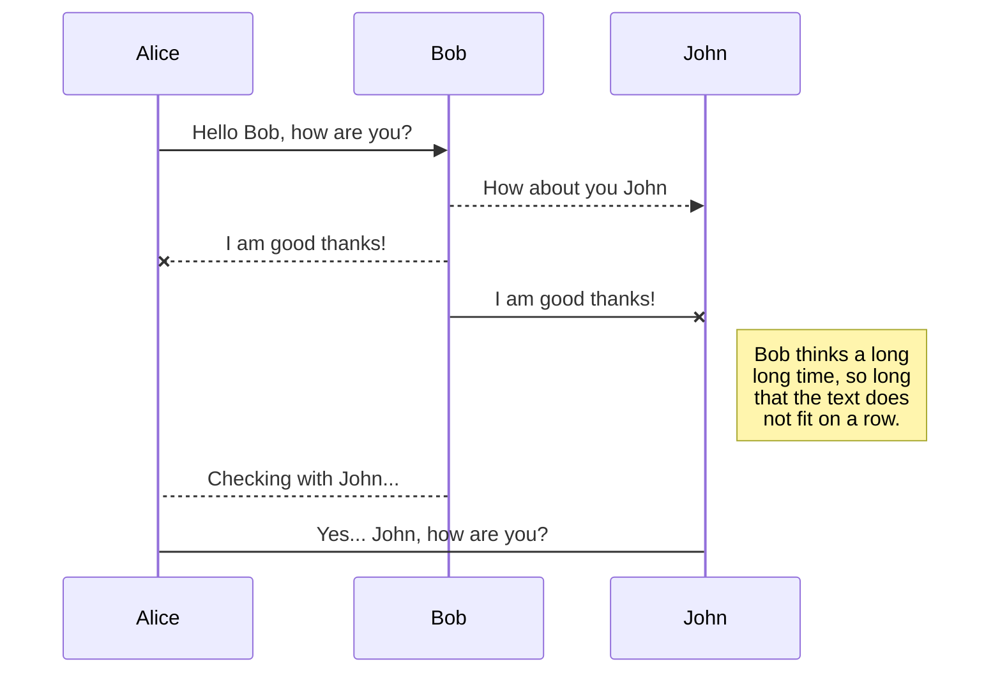

# Markdown Docs: Example Document

This document serves as an example to showcase the capabilities of the **Markdown Docs** VS Code extension. It includes various Markdown elements and highlights features relevant to the extension.

***

## 🚀 Key Features in Action

### ✍️ WYSIWYG Editing Experience

With Markdown Docs, you get a seamless **What You See Is What You** Get **(WYSIWYG)** editing experience. No more switching between raw Markdown and a preview pane! Edit directly and see your changes instantly.

### 💬 Interactive Commenting

This extension allows you to add comments directly within your Markdown files. Imagine leaving feedback for an AI model, annotating your personal notes, or collaborating with a team. Comments appear in a dedicated sidebar, and you can **click to focus** on the corresponding text in the editor.

### 🔍 Highlighted Search

Easily find content within your document with the built-in highlighted search functionality. Type your query, and see matches highlighted in real-time.

### 🔠 Customizable Display Font

Tailor your editing environment by changing the display font directly within the editor settings. Choose a font that suits your preference for optimal readability.

***

## Standard Markdown Elements

### Headings

#### Level 4 Heading

##### Level 5 Heading

###### Level 6 Heading

### Text Formatting

This is a paragraph with some **bold text**, *italic text*, and even ***bold and italic text***. You can also `highlight code inline` or ~~strike through text~~.

### Lists

#### Ordered List

1. First item
2. Second item
   1. Nested ordered item
   2. Another nested item
3. Third item

#### Unordered List

* Apple
* Banana
  * Green banana
  * Yellow banana
* Cherry

#### Checkbox List

* [x] Task completed
* [ ] Task pending
* [ ] Another task

### Links

Visit the [Google website](https://www.google.com).

### Code Blocks

```javascript
function helloWorld() {
  console.log("Hello, Markdown Docs!");
}
helloWorld();
```

```python
def greet(name):
    return f"Hello, {name}!"

print(greet("AI"))
```

### Mermaid



### Blockquotes

> "The only way to do great work is to love what you do."- Steve Jobs

### Tables

| Header 1    | Header 2    | Header 3    |
| :---------- | :---------- | :---------- |
| Row 1 Col 1 | Row 1 Col 2 | Row 1 Col 3 |
| Row 2 Col 1 | Row 2 Col 2 | Row 2 Col 3 |

***

This example document should provide a good basis for showcasing the Markdown Docs extension in action. Feel free to add comments, modify content, and explore all the features!