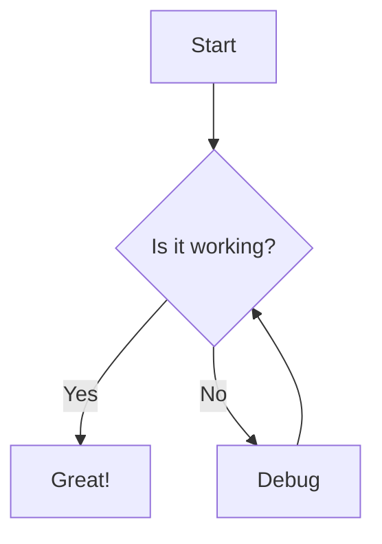
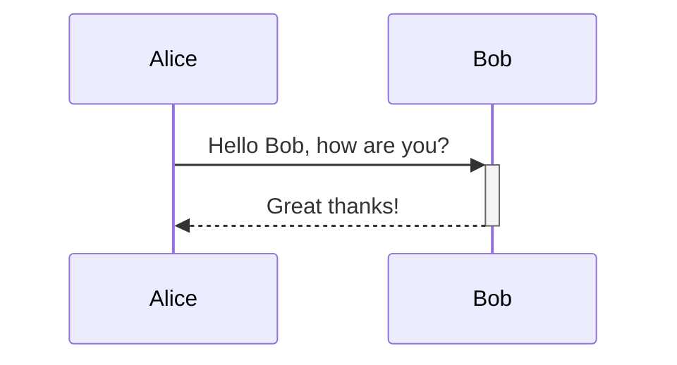
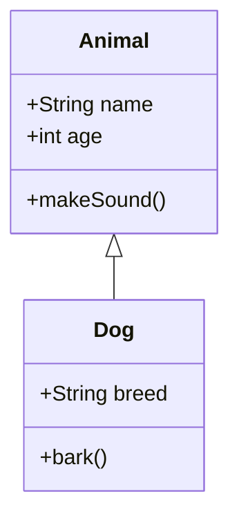
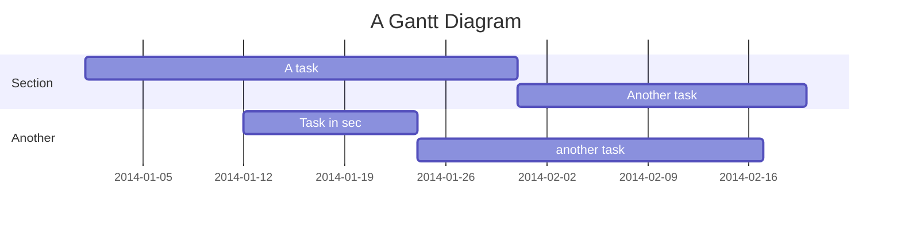

# Mermaid Diagrams Test

This document tests the new Mermaid diagram rendering functionality with three view modes:
- **📊 Preview**: View rendered diagram only
- **✏️ Edit**: Edit mermaid code only  
- **📱 Split**: Side-by-side code and diagram with real-time updates and resizable panes

## Simple Flowchart



Try clicking the "📱 Split" button above to see real-time editing!

## Sequence Diagram



## Class Diagram



## Gantt Chart



Regular code blocks should still work normally:

```javascript
function hello() {
    console.log("Hello, World!");
}
```

```python
def greet(name):
    print(f"Hello, {name}!")
```